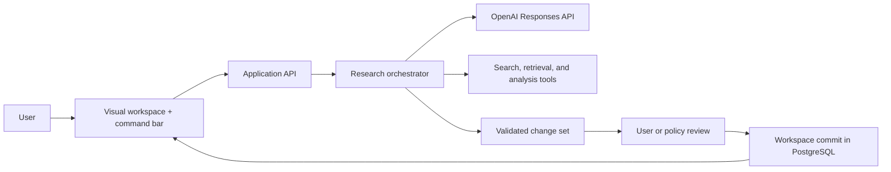

# Yomirai

Yomirai is a visual AI research workspace: a product that combines a conversational command surface with structured, versioned knowledge and multiple visual views.

The central product rule is simple:

> Chat is the interface. The workspace is the source of truth.

Instead of producing an endless sequence of answers, the assistant proposes typed changes to a workspace. Users can inspect, apply, edit, or discard those changes. The same underlying knowledge can then be explored as a document, table, graph, timeline, or board.

This repository currently contains the product and technical plan only. No implementation has started.

## Recommended MVP

Build two tightly connected capabilities:

1. **Structured research workspace** — sources, findings, entities, notes, questions, and relations are durable objects rather than fragments buried in messages.
2. **Proposal-to-commit workflow** — AI work arrives as a reviewable change set with citations, validation, and version history before it becomes trusted workspace data.

Visual views are the expression of those capabilities, not a third data system. The MVP should ship document, table, and graph views; timeline follows when date-bearing objects are stable.

## Documentation map

| Document | Purpose |
| --- | --- |
| [Product brief](docs/00-product-brief.md) | Problem, target users, scope, principles, and success metrics |
| [User experience](docs/01-user-experience.md) | Core flows, screen model, response types, and UX rules |
| [Domain model](docs/02-domain-model.md) | Workspace data model, invariants, provenance, and versioning |
| [System architecture](docs/03-system-architecture.md) | Components, storage, deployment, and runtime boundaries |
| [AI orchestration](docs/04-ai-orchestration.md) | Request routing, research loop, prompts, tools, and model strategy |
| [API and events](docs/05-api-and-events.md) | Application API surface, commands, jobs, and event contracts |
| [Quality and security](docs/06-security-reliability-evals.md) | Permissions, prompt-injection defenses, observability, and evals |
| [Delivery roadmap](docs/07-roadmap.md) | Phases, vertical slices, acceptance criteria, and deferred work |
| [Project structure](docs/08-project-structure.md) | Proposed monorepo layout and module ownership |
| [UI/UX design system](docs/design/) | Premium Japanese-inspired visual direction, components, motion, and screen specifications |
| [Architecture decisions](docs/adr/) | Durable technical decisions and their trade-offs |

## Architecture at a glance

## Current decisions

- Start as a TypeScript modular monolith in a monorepo, with a separate worker process using the same domain packages.
- Use PostgreSQL as the authoritative store; use object storage for uploaded originals and derived artifacts.
- Represent knowledge with typed objects, relations, evidence, and views; use JSONB only for type-specific properties.
- Treat every AI mutation as an untrusted proposal until schema, authorization, referential, provenance, and conflict checks pass.
- Use a bounded workflow/state machine, not an unconstrained autonomous loop and not a multi-agent system for MVP.
- Keep provider-specific response IDs and tool traces as execution metadata, never as the only copy of user knowledge.

See the ADRs for the reasoning behind these choices.
