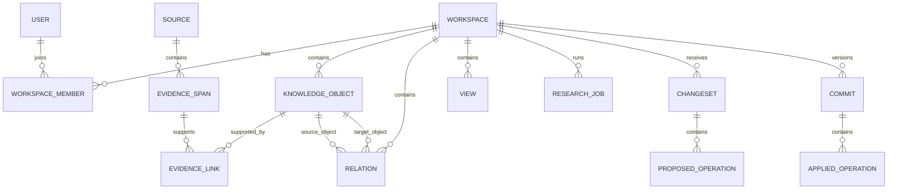

# Domain model

## Design goals

The model must be flexible enough for history, science, travel, literature, market research, and personal study without creating domain-specific tables or actions. It must also be structured enough to validate AI proposals and render useful views.

The recommended solution is a relational knowledge kernel:

- stable typed records for shared semantics;
- JSONB properties for type-specific attributes;
- explicit relations for graph traversal;
- first-class sources and evidence for provenance;
- immutable commits and operations for history;
- saved views as queries over canonical data.

PostgreSQL is sufficient for the MVP. A graph database would add operational cost before traversal needs justify it.

## Core aggregates



## Workspace

A workspace is the authorization, versioning, retrieval, and billing boundary.

Required fields:

- `id`
- `owner_id`
- `title`
- `goal`
- `default_language`
- `status`: active or archived
- `version`: monotonically increasing commit version
- `created_at`, `updated_at`

Optional policy fields include permitted source domains, time range, geography, auto-apply preferences, retention policy, and model budget.

## Knowledge object

All durable workspace content shares a common envelope:

```json
{
  "id": "obj_...",
  "workspace_id": "ws_...",
  "kind": "finding",
  "title": "Irrigation diversion was the principal direct cause",
  "body": "...",
  "properties": {},
  "status": "active",
  "epistemic_status": "sourced_fact",
  "created_by": "user_or_run_id",
  "created_at": "...",
  "updated_at": "...",
  "revision": 4
}
```

### Object kinds

| Kind | Role | Examples of properties |
| --- | --- | --- |
| `entity` | A named concept or thing | subtype, aliases, dates, location |
| `finding` | A claim or conclusion | importance, confidence band, verification status |
| `note` | User or AI-authored freeform material | tags, pinned |
| `question` | An unresolved research question | priority, status, assignee |
| `task` | A concrete action | status, due date, assignee |
| `event` | Something occurring in time | start date, end date, precision |
| `document` | An uploaded/created document | file ID, MIME type, parse status |
| `dataset` | A tabular or structured dataset | schema summary, row count, storage reference |
| `source` | A cited external or uploaded source | URL, publisher, publication date, source class |

`source` may be implemented as a specialized table for indexing and deduplication while still appearing as a knowledge object through the domain layer. The API should not leak storage-specific differences.

## Epistemic status

Every finding and evidence-bearing statement has one of:

- `quoted_statement` — a source explicitly states it;
- `sourced_fact` — directly supported by cited evidence;
- `inference` — derived from evidence but not directly stated;
- `hypothesis` — plausible and intentionally unverified;
- `user_assertion` — supplied by the user without external verification;
- `disputed` — credible evidence conflicts;
- `unknown` — classification not yet completed.

Avoid presenting a model-generated percentage as objective confidence. The MVP may use `high`, `medium`, or `low` only when accompanied by reasons such as source quality, agreement, recency, and directness.

## Relations

A relation is a directed, labeled edge between two objects:

- `id`
- `workspace_id`
- `from_object_id`
- `predicate`
- `to_object_id`
- `properties`
- `epistemic_status`
- `revision`

Predicates use normalized machine keys such as `causes`, `precedes`, `part_of`, `located_in`, `contradicts`, `supports`, or `related_to`, with human-readable labels in the UI.

The predicate vocabulary is extensible but controlled per workspace. The model may propose a new predicate; the validator can map aliases or require review rather than producing thousands of near-duplicates.

## Source and evidence

A source record stores bibliographic and retrieval metadata, not just a URL:

- canonical URL or uploaded file reference;
- title, publisher/author, publication date, accessed date;
- source class: primary, institutional, scholarly, journalism, commentary, user-provided;
- content hash and canonicalization key;
- retrieval status and parser version;
- rights/availability metadata where relevant.

An evidence span identifies the precise material used:

- source ID;
- excerpt or normalized text;
- locator: page, section, paragraph, timestamp, or character range;
- content hash;
- retrieval timestamp;
- optional snapshot reference;

An evidence link joins an evidence span to a finding or relation and records:

- support type: supports, contradicts, contextualizes;
- directness: direct or indirect;
- note explaining the connection;
- actor/run that created the link.

This separation allows one source span to support multiple findings and one finding to have supporting and contradicting evidence.

## Views

A view contains no independent facts. It stores:

- `type`: document, table, graph, timeline;
- title and description;
- query/filter definition;
- layout and display configuration;
- optional ordered block references;
- owner and sharing metadata;
- version.

Example graph view configuration:

```json
{
  "type": "graph",
  "query": {
    "seed_ids": ["obj_aral_sea"],
    "max_depth": 2,
    "kinds": ["entity", "finding", "event"]
  },
  "layout": {
    "algorithm": "force",
    "group_by": "kind"
  }
}
```

## Change sets and operations

A change set is an uncommitted proposal based on a specific workspace version. It contains atomic operations with dependencies.

MVP operation vocabulary:

- `object.create`
- `object.update`
- `object.archive`
- `object.merge`
- `relation.create`
- `relation.update`
- `relation.archive`
- `evidence.attach`
- `evidence.detach`
- `view.create`
- `view.update`

Hard deletion, permission changes, and arbitrary schema changes are not model operations.

Each operation includes:

- stable operation ID;
- target or temporary reference;
- base revision when updating;
- typed payload;
- dependencies on other operations;
- rationale visible to the user;
- provenance references;
- risk classification;
- validation state.

Temporary references allow one proposal to create an object and then relate evidence or another object to it without guessing database IDs.

## Commits and history

Applying accepted operations creates one atomic commit:

- commit ID and workspace version;
- parent version;
- actor: user, service, or approved AI run;
- originating request and change-set ID;
- applied operations, including user edits;
- timestamp and optional message;
- integrity hash.

The current state may be stored normally in relational tables; it does not need to be reconstructed from events on every read. The operation log is an audit/version record, not full event sourcing.

Revert creates compensating operations against the current version. It does not erase history.

## Invariants

1. Every durable record belongs to exactly one workspace.
2. Cross-workspace relations and evidence links are forbidden.
3. Every mutation has an actor and commit.
4. Model-generated changes cannot skip validation.
5. Updates require a matching base revision or explicit conflict resolution.
6. Archived objects remain addressable by history but are excluded from normal views.
7. A `sourced_fact` must have at least one supporting evidence link.
8. Evidence locators must resolve to the stored source version/hash.
9. Views reference canonical IDs or deterministic queries, never copied objects.
10. Applying a change set is atomic after invalid or rejected operations are removed.

## Retrieval model

Retrieval combines:

- structured filters by workspace, kind, status, date, and relation;
- PostgreSQL full-text search for exact terms;
- vector similarity for semantic recall;
- graph-neighborhood expansion for related objects;
- recency and evidence-quality reranking.

The context builder returns a bounded, typed bundle with object IDs and revisions. It never serializes the entire workspace by default.
