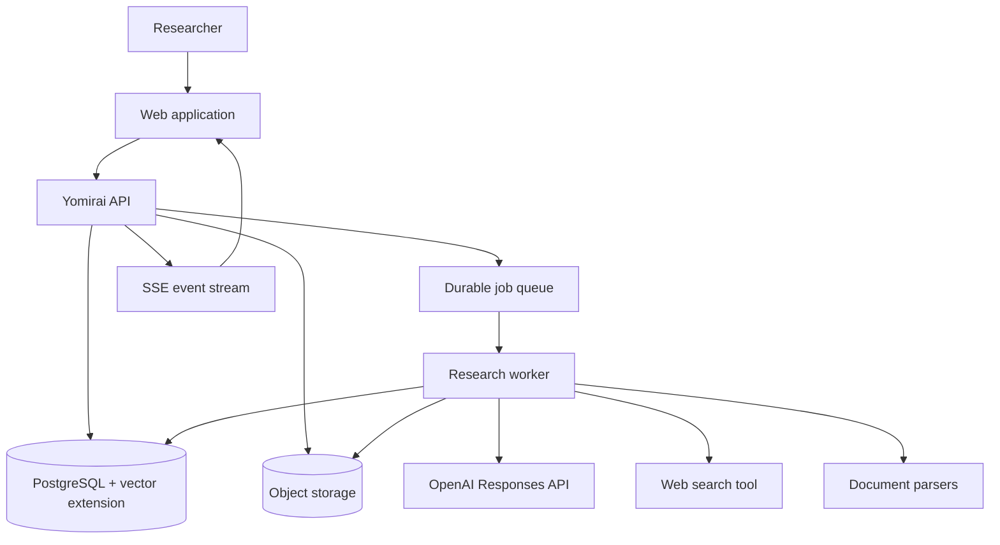
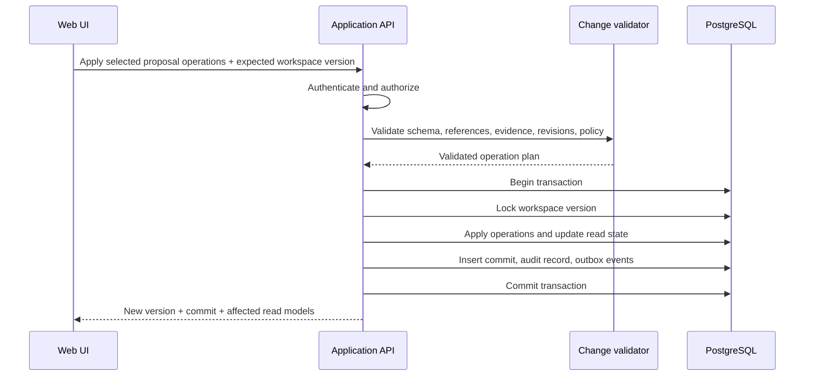
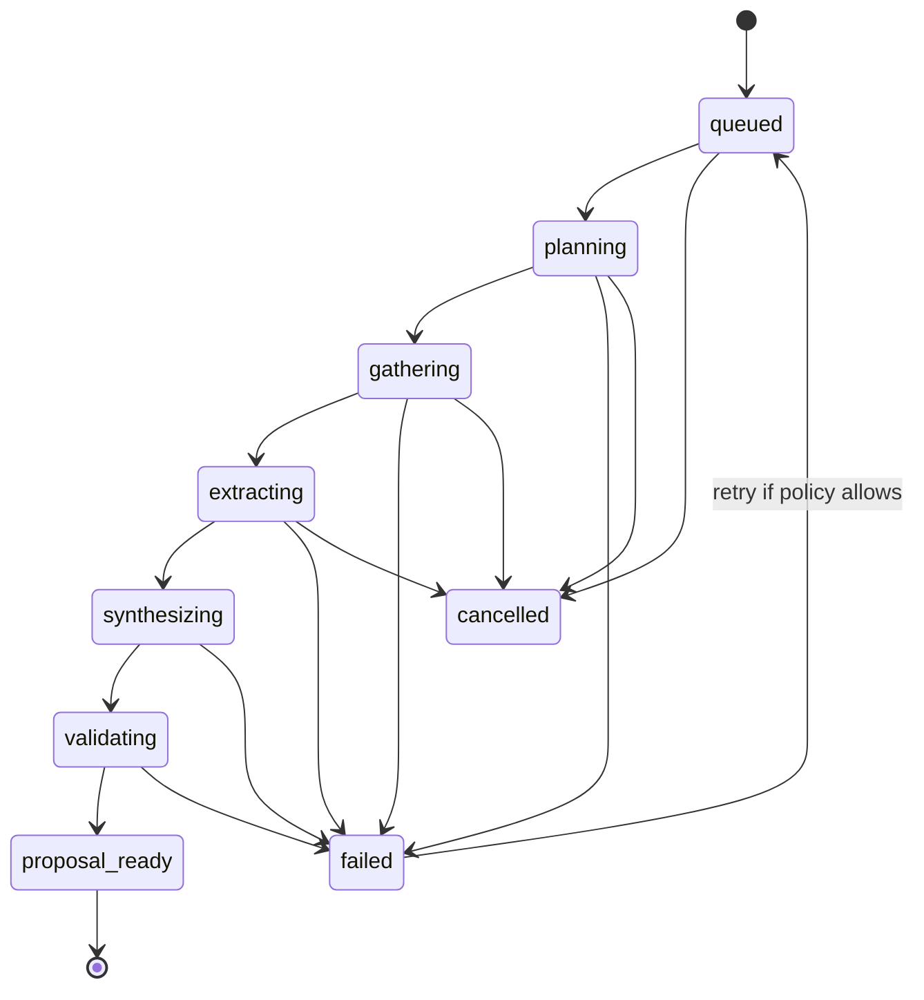

# System architecture

## Architectural style

Start with a **modular monolith** deployed as three processes from one TypeScript codebase:

- web application;
- HTTP/realtime API;
- background worker.

All domain modules share one PostgreSQL database but communicate through explicit application interfaces and domain events. This gives the MVP clear boundaries without the deployment and consistency costs of microservices.

The worker is separated at runtime because document parsing and AI research are slow, retryable workloads. It is not a separate service ownership boundary yet.

## System context

## Recommended technology baseline

The baseline is intentionally replaceable at module boundaries.

| Concern | Recommendation | Reason |
| --- | --- | --- |
| Language | TypeScript | Shared domain and contracts across web, API, and worker |
| Monorepo | pnpm workspaces + Turborepo | Simple task orchestration and package boundaries |
| Web | Next.js + React | Product UI, routing, server rendering where useful |
| API | Fastify with schema-first routes | Low overhead, explicit HTTP boundary, good streaming support |
| Validation | Zod or JSON Schema generated from one contract source | Same validation for routes, operations, and model outputs |
| Database | PostgreSQL | Transactions, JSONB, full-text search, relational integrity |
| Semantic search | pgvector | Keeps workspace retrieval with authorization and canonical data |
| ORM/query layer | Drizzle ORM or Kysely | SQL visibility and strong TypeScript types |
| Job queue | PostgreSQL-backed queue initially | Durable jobs without a separate Redis dependency |
| File storage | S3-compatible object storage | Original uploads, snapshots, and derived artifacts |
| AI provider | OpenAI Responses API behind an adapter | Tool use, structured outputs, cited web search, background capability |
| Realtime progress | Server-Sent Events | One-way job/proposal progress is simpler than WebSockets |
| Observability | OpenTelemetry + structured logs + error tracking | Cross-process traceability and provider-neutral telemetry |

These are defaults for planning, not a requirement to choose vendors before implementation. Authentication, email, analytics, and hosting can use managed services as long as domain boundaries remain independent.

## Runtime components

### Web application

Responsibilities:

- render explorer, canvas, inspector, and activity drawer;
- maintain local view state and optimistic non-domain UI state;
- subscribe to job and proposal events;
- show proposal diffs and collect partial acceptance/user edits;
- perform accessible graph/table/document interactions;
- never apply domain mutations locally without API confirmation.

The web client may cache query data, but the API response version is authoritative.

### API application

Responsibilities:

- authenticate the caller and resolve workspace membership;
- expose commands and read models;
- enforce authorization and input limits;
- create jobs and change sets;
- apply accepted operations transactionally;
- publish domain/job events;
- issue short-lived upload/download URLs;
- stream progress events.

The API is the only component allowed to commit workspace mutations. The worker can create proposals and execution records, not directly alter canonical objects.

### Research worker

Responsibilities:

- claim durable jobs;
- run the orchestration state machine;
- invoke models and tools within explicit budgets;
- parse and index documents;
- normalize sources and evidence;
- create validated draft proposals;
- emit stage-level progress, usage, warnings, and failure events;
- support cancellation and idempotent retry.

### Workspace module

Owns:

- knowledge objects and revisions;
- relations and predicate normalization;
- views and their query definitions;
- workspace membership and policies;
- retrieval of structured context.

### Evidence module

Owns:

- sources, canonical URLs, and document records;
- source deduplication and content hashes;
- evidence spans and locators;
- evidence-to-claim links;
- source quality metadata and conflict surfaces.

### Change module

Owns:

- change sets and operation states;
- validation pipeline;
- operation dependency graph;
- atomic apply, commit creation, and compensating reverts;
- conflict detection against base revisions.

### Research module

Owns:

- request classification and planning;
- context bundles;
- job state machine and budgets;
- provider/tool adapters;
- model execution records and traces;
- final proposal assembly.

### Ingestion module

Owns:

- upload lifecycle and malware/content-type checks;
- text extraction and OCR routing;
- chunking and metadata preservation;
- embeddings and retrieval index updates;
- parser/index version tracking.

## Data stores

### PostgreSQL

Authoritative for:

- users, workspaces, memberships, and policies;
- objects, relations, views, sources, and evidence;
- change sets, operations, commits, and audit log;
- research jobs, attempts, budgets, and usage;
- document/chunk metadata and embeddings;
- outbox events and queue state.

Use row-level authorization in the application layer from day one. Database row-level security can provide defense in depth later, but should not replace tests around service-level authorization.

### Object storage

Stores:

- original uploads;
- sanitized/normalized derivatives;
- optional web snapshots where lawful and permitted;
- large generated exports later.

Database rows hold ownership, hash, MIME type, size, retention state, and storage key. Raw keys are never accepted from clients.

### Provider-side state

OpenAI response IDs, tool calls, and provider file/vector IDs are execution metadata. They may help continue a run, but Yomirai must retain its own normalized source, evidence, and workspace data.

This matters because provider responses have their own retention behavior and conversation objects have different persistence semantics. Data lifecycle must be governed by Yomirai’s workspace policy, not accidental provider defaults.

## Write path

The transactional outbox prevents “database committed but event not published” failures. A dispatcher publishes outbox records to SSE subscribers and asynchronous projections.

## Research job state machine

Each transition is persisted with an idempotency key. Retrying a stage must not duplicate sources, evidence, or proposals.

## Deployment topology

### MVP

- one web deployment;
- one API deployment with horizontal scaling optional;
- one worker deployment with configurable concurrency;
- managed PostgreSQL with backups and vector extension;
- managed S3-compatible storage;
- provider secret manager;
- CDN for static web assets.

Web, API, and worker can be deployed from one container image with different entry points if that simplifies operations.

### Scaling triggers

Split components only after measured pressure:

- ingestion becomes its own worker pool when parser CPU/memory competes with research jobs;
- search indexing separates when embedding throughput dominates;
- collaboration gateway appears only with real-time multi-user editing;
- an analytics warehouse appears when product/audit queries affect transactional performance;
- a graph database is considered only if multi-hop query latency or graph algorithms cannot be met in PostgreSQL.

## Consistency model

- Applying a change set is strongly consistent and atomic.
- Job progress is eventually consistent and ordered by per-job sequence number.
- Search indexes may lag canonical writes briefly; API responses return the affected records directly after a commit.
- Views are read models over canonical state and a specific workspace version.
- Provider callbacks/events are deduplicated by provider event ID plus internal run ID.

## Availability and recovery

- Every mutating endpoint accepts an idempotency key.
- Worker leases expire and can be reclaimed.
- Model/tool calls store request fingerprints, attempt count, and safe replay metadata.
- Database backups and point-in-time recovery protect workspace state.
- Object lifecycle deletion is coordinated through durable deletion jobs.
- A provider outage preserves queued jobs and allows users to continue manual workspace work.

## Why not microservices, graph DB, or CRDT now?

The central risks are product correctness and AI trust, not independent team scaling. Transactions across evidence, objects, and commits are a strength in the MVP. PostgreSQL handles relational and modest graph queries well. Single-user plus optimistic concurrency handles initial editing. These choices can be revisited with evidence rather than assumed scale.
