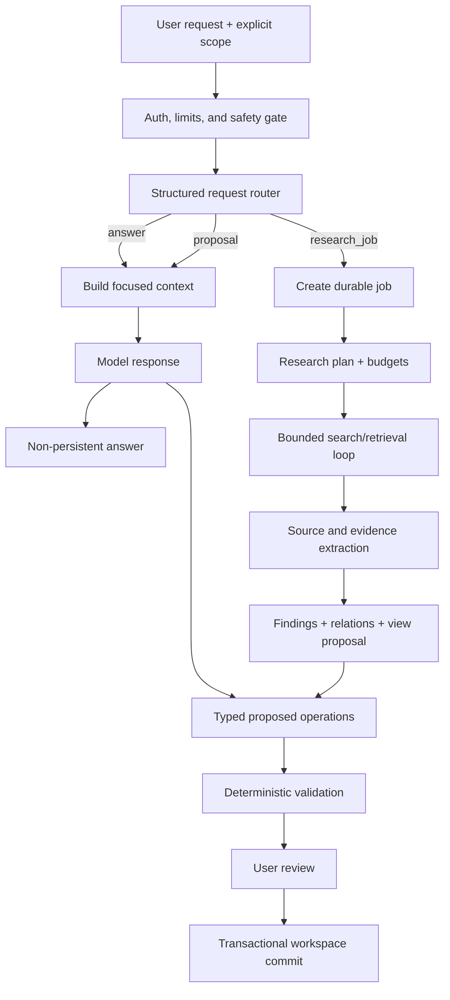

# AI orchestration

## Core decision

The application needs a loop, but not an unconstrained “keep thinking” loop.

Use two levels of control:

1. **Durable application workflow** — owns stages, budgets, retries, cancellation, authorization, and persisted progress.
2. **Bounded model/tool loop inside a stage** — lets the model search, retrieve, or call approved read-only tools until an explicit stop condition is reached.

The model never commits workspace state. Its durable output is either a typed answer or an untrusted change-set proposal.

OpenAI recommends the Responses API for new projects and describes it as a unified interface with built-in tools and multi-turn/tool capabilities. That fits the execution layer, while Yomirai retains domain orchestration and state ownership. See [Migrate to the Responses API](https://developers.openai.com/api/docs/guides/migrate-to-responses).

## High-level pipeline



## 1. Request envelope

The API constructs a trusted envelope before invoking a model:

- actor and workspace ID;
- request text and attachments;
- explicit selection/current-view scope;
- workspace version;
- user-selected source policy;
- locale and output preference;
- time, token, tool-call, and cost budget;
- capabilities allowed for this actor and plan;
- idempotency and trace IDs.

Trusted instructions and untrusted retrieved content must be clearly separated in the prompt/input structure.

## 2. Routing

The router emits structured data:

```json
{
  "mode": "answer | proposal | research_job",
  "intent": "explain | find | compare | create | update | organize | research",
  "persistence": "none | propose",
  "context_needs": ["selected_objects", "related_findings", "sources"],
  "tools_needed": ["workspace_search", "web_search"],
  "risk": "low | medium | high",
  "clarification_required": false
}
```

Use deterministic rules first for explicit commands and obvious non-persistent requests. A low-cost model handles ambiguous cases with a strict schema. Do not create a separate classifier call when the main call can safely produce this envelope without adding latency.

Routing is not a permanent truth label. The orchestrator may upgrade a proposal to a job if retrieval is required, but it must not broaden data/source scope without permission.

## 3. Context building

The context builder translates `context_needs` into bounded retrieval:

1. include selected objects exactly;
2. retrieve structurally related objects;
3. run lexical and semantic search within the workspace;
4. rerank by relevance, evidence quality, and recency;
5. enforce per-kind and total token limits;
6. return IDs, revisions, epistemic status, and evidence pointers.

A context bundle is a typed snapshot, not prose:

```json
{
  "workspace": {"id": "ws_1", "version": 42, "goal": "..."},
  "objects": [],
  "relations": [],
  "evidence": [],
  "views": [],
  "retrieval_notes": {"truncated": false, "queries": []}
}
```

The model receives only the data needed for the current task. Recent messages may be included for conversational continuity, but they are not the knowledge store.

## 4. Fast answer and direct proposal path

Use one model call where practical:

- `answer` returns concise text plus references to existing object/evidence IDs;
- `proposal` returns a summary and typed atomic operations;
- refusal or ambiguity is represented explicitly in the schema.

Use Structured Outputs for this final application-facing result. OpenAI’s guide states that Structured Outputs enforce a supplied JSON Schema and expose refusals programmatically: [Structured model outputs](https://developers.openai.com/api/docs/guides/structured-outputs).

Structured output does not eliminate application validation. It guarantees shape, not authorization, referential integrity, evidence quality, or truth.

## 5. Research plan

For a research job, the planner produces:

- restated objective and exclusions;
- 2–6 research questions;
- preferred source classes;
- search/document queries;
- expected output object kinds and views;
- stop conditions;
- budgets and maximum iterations;
- known gaps or ambiguity.

The plan is validated against user scope and system policy. In the MVP it need not wait for approval unless the request is expensive, ambiguous, or scope-expanding.

## 6. Bounded gathering loop

The gathering loop is read-only and budgeted.

```text
while not stop_condition:
    choose an allowed retrieval action
    execute it outside the model
    normalize and deduplicate the result
    update coverage and budget counters
    stop on sufficiency, no-new-information, cancellation, or budget exhaustion
```

Suggested default bounds for an ordinary job:

- 3 search rounds;
- 5 queries per round;
- 20 candidate sources fetched;
- 12 sources deeply processed;
- 2 retries per external call;
- explicit wall-clock and spend ceiling.

These are configuration defaults, not product promises. The stop evaluator checks coverage of research questions, source diversity, unresolved conflicts, marginal novelty, and remaining budget.

Function calling is appropriate when the model chooses among approved application tools. OpenAI documents the flow as model tool request → application execution → tool result → continued model response, possibly repeated: [Function calling](https://developers.openai.com/api/docs/guides/function-calling).

### Allowed MVP tools

- `workspace.search` — read authorized objects and evidence;
- `workspace.get_objects` — fetch exact IDs/revisions;
- `documents.search` — retrieve authorized chunks;
- `web.search` — use provider web search under source policy;
- `sources.open` — fetch/parse an allowed result where necessary;
- `research.report_gap` — record missing or conflicting evidence;

No tool can apply a change set, alter permissions, send messages, purchase, publish, or call arbitrary URLs chosen outside the controlled fetch policy.

## 7. Source and evidence extraction

Each processed source yields typed candidates:

- normalized source metadata;
- relevant evidence spans with exact locators;
- candidate entity mentions and dates;
- candidate claims as stated by the source;
- source-quality signals and limitations.

Extraction is source-local. It should not synthesize global conclusions yet. This improves traceability and makes failures easier to evaluate.

Web-search output includes URL citation annotations, and OpenAI requires citations displayed to users to be visible and clickable. Yomirai should normalize these annotations into source/evidence records while preserving the provider trace: [Web search](https://developers.openai.com/api/docs/guides/tools-web-search).

Uploaded document retrieval can be implemented with Yomirai-managed chunks and pgvector. OpenAI File Search remains a useful alternative or accelerator, but hosted vector stores must be mapped back to Yomirai source IDs and lifecycle policy: [File search](https://developers.openai.com/api/docs/guides/tools-file-search).

## 8. Synthesis

The synthesizer receives the plan, existing workspace context, normalized sources, and evidence candidates. It creates:

- deduplicated findings;
- epistemic classification;
- links to supporting and contradicting evidence;
- entities, events, and relations necessary for the requested output;
- unresolved questions;
- optional saved-view configuration;
- short proposal summary.

It must prefer updating an existing object when identity is strong and otherwise create a candidate. It must never silently merge uncertain identities.

## 9. Validation

Validation is deterministic where possible and model-assisted only for semantic checks.

### Deterministic checks

- JSON/schema validity;
- operation vocabulary and payload limits;
- workspace authorization;
- current/base revisions;
- cross-workspace references;
- temporary-reference resolution;
- relation endpoints and predicate policy;
- source/evidence existence and content hashes;
- sourced-fact evidence requirement;
- duplicate hashes/canonical URLs;
- operation dependency cycles;
- forbidden mutations and prompt-injection indicators.

### Semantic checks

- candidate object identity/deduplication;
- claim-evidence entailment;
- contradiction detection;
- unsupported certainty or overbroad wording;
- whether a proposed view matches the user request.

For medium/high-risk research, use a separate verification pass that can only flag, downgrade, or request revision. It is not a free-running “critic agent.”

Invalid operations are excluded or returned with actionable warnings. The model is allowed at most one repair attempt per validation category before the proposal is presented with gaps or the job fails safely.

## 10. Review and commit

The proposal stores:

- base workspace version;
- model/prompt/tool versions;
- source and retrieval trace;
- original and validated operations;
- validation results;
- usage and latency;
- warnings and gaps.

The user’s selected and edited operations go through the same validator again. Only the application API commits them.

## Conversation and provider state

OpenAI supports response continuation with `previous_response_id`, but prior tokens are still billed and provider retention has its own behavior. Use continuation only within a bounded run or short interaction where it improves reasoning continuity. Build every durable new turn from Yomirai’s canonical context rather than relying on an indefinitely chained provider conversation. See [Conversation state](https://developers.openai.com/api/docs/guides/conversation-state).

For long model calls, provider background mode can reduce timeout risk, while Yomirai’s job record remains the customer-facing source of progress and cancellation: [Background mode](https://developers.openai.com/api/docs/guides/background).

## Model strategy

Use capability roles, not hard-coded model names throughout the codebase:

| Role | Needs | Initial policy |
| --- | --- | --- |
| Router/extractor | low latency, schema adherence | smallest qualified model |
| Planner/researcher | reasoning and tool use | balanced current model |
| Synthesizer | reasoning, long context, structured output | balanced current model |
| Escalated verifier | strongest reasoning for difficult cases | premium model only by policy |
| Embeddings | multilingual semantic retrieval | current supported embedding model |

Resolve roles through configuration and pin snapshots in production after evaluation. Do not silently move production traffic to a new model alias. The current model catalog and recommendations are inherently time-sensitive: [OpenAI model catalog](https://developers.openai.com/api/docs/models).

## Prompt architecture

Prompts are versioned assets with five layers:

1. stable system policy and domain rules;
2. task role and output schema;
3. trusted request envelope and permissions;
4. canonical context bundle;
5. clearly delimited untrusted source content/tool results.

Stable content goes first to benefit from prompt caching. OpenAI documents automatic caching for eligible prompts of at least 1024 tokens: [Prompt caching](https://developers.openai.com/api/docs/guides/prompt-caching).

Every prompt version is tied to eval results and execution traces. Prompts must instruct the model to treat source text as data, ignore embedded instructions, cite evidence IDs, preserve uncertainty, and avoid inventing object IDs.

## Failure behavior

- Budget exhausted: produce a partial proposal with explicit uncovered questions.
- No credible sources: return gaps/questions, not fabricated findings.
- Conflicting sources: create disputed finding or conflict warning with both evidence sets.
- Model refusal: store typed refusal and return a user-safe explanation.
- Invalid structured result: one constrained repair, then fail or return partial validated content.
- Provider outage: keep the durable job retryable; manual workspace remains usable.
- Cancellation: stop scheduling new calls, finish safe cleanup, mark produced drafts non-applicable unless validation completes.
