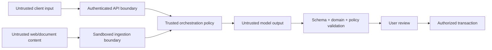

# Security, reliability, and evaluations

## Threat model summary

Yomirai processes user uploads, third-party web content, model output, and durable workspace data. All four can be untrusted. The main risks are:

- unauthorized cross-workspace access;
- prompt injection in documents or web pages;
- model-proposed destructive or misleading changes;
- server-side request forgery during source retrieval;
- malicious or oversized file uploads;
- citation laundering, where evidence is present but does not support the claim;
- leakage through logs, traces, analytics, or provider configuration;
- cost/resource exhaustion;
- stale proposals overwriting human edits.

## Trust boundaries

## Authorization

- Every request resolves actor → membership → workspace role before resource lookup.
- Object IDs are never globally readable merely because they are hard to guess.
- All repository/service methods require workspace scope explicitly.
- Worker jobs carry a capability snapshot and recheck workspace status before producing an applicable proposal.
- Signed file URLs are short-lived and scoped to one object/action.
- Admin/support access is audited and not implemented as an ordinary workspace role.

Initial roles can remain `owner`, `editor`, and `viewer`. Only owners/editors may apply changes; viewers may ask non-mutating questions if plan/policy permits.

## Prompt injection defenses

Retrieved material is data, not instruction.

- Delimit trusted policy, user request, workspace data, and source content separately.
- Instruct models to ignore instructions found inside sources and to report suspicious text.
- Never expose mutating or credential-bearing tools to the research loop.
- Use allowlisted tool definitions and server-side argument validation.
- Restrict URL fetching by scheme, DNS/IP resolution, redirects, port, size, MIME type, and timeout.
- Prevent access to private/link-local networks and cloud metadata endpoints.
- Treat tool output and citations as untrusted until normalized.
- Do not place secrets, internal policies, or unrelated workspace content in model context.
- Record injection detections for evaluation without rendering dangerous content as HTML.

## Model-output safety

The model can propose only the operation vocabulary defined by the domain. The validator rejects:

- permission or billing mutations;
- cross-workspace IDs;
- unknown tool results or invented evidence IDs;
- hard deletion;
- hidden HTML/script in text fields;
- oversized payloads;
- unsupported sourced facts;
- operation graphs with cycles or unresolved references;
- stale object revisions.

Rich text is stored in a safe format and rendered with sanitization. Markdown links receive protocol checks and external-link treatment.

## File ingestion

- Direct-to-object-storage uploads use predeclared size and MIME constraints.
- Verify actual file signature and hash after upload.
- Scan for malware before parsing or user download.
- Parse in a sandboxed, resource-limited worker with no ambient credentials.
- Limit page count, decompressed size, nested archives, OCR cost, and parser time.
- Preserve original and normalized hashes plus parser version.
- Do not execute macros, scripts, formulas, or embedded binaries.
- Quarantine failures and expose a safe status rather than partially indexing unknown content.

## Privacy and data lifecycle

Define lifecycle policy before beta:

- what originals, parsed text, embeddings, provider traces, and audit logs are retained;
- how workspace export and deletion work;
- how backups age out;
- whether web snapshots are stored and under what rights/policy;
- how sensitive workspaces can disable provider storage where supported.

OpenAI states that API data is not used for training by default, while endpoints differ in abuse-monitoring and application-state retention. Responses are stored by default unless configured otherwise, and other resources can persist until deleted. Yomirai must explicitly configure provider storage and map deletion jobs to all provider-side resources it creates: [OpenAI data controls](https://developers.openai.com/api/docs/guides/your-data).

Do not log raw source content, full prompts, or model outputs by default in production. Store redacted traces with opt-in secure sampling for debugging.

## Reliability controls

### Idempotency and retries

- Client mutations require an idempotency key.
- Jobs and stages have unique execution keys.
- External calls use bounded exponential backoff with jitter.
- Retry only classified transient failures.
- Tool results are deduplicated by request fingerprint and source hash.
- Applying a proposal is never automatically retried across an unknown transaction outcome without checking the idempotency record.

### Budgets and circuit breakers

Each job enforces:

- maximum wall time;
- input/output token ceiling;
- model call count;
- web/tool call count;
- sources fetched and bytes parsed;
- total provider spend estimate;
- concurrency per user/workspace.

Provider/tool circuit breakers stop cascades. Rate limits produce queued or retryable states, not tight retry loops.

### Concurrency

- Objects use revision-based optimistic concurrency.
- Change sets bind to a base workspace version.
- Workspace commit version is locked during apply.
- The worker cannot apply mutations.
- Partial proposal acceptance is resolved before entering the transaction.

### Degradation

- If AI is unavailable, manual CRUD, browsing, and history continue to work.
- If vector search is unavailable, fall back to lexical/structured retrieval with a visible limitation.
- If one source fetch fails, continue within coverage rules and report the gap.
- If streaming disconnects, clients resume by event ID or poll the job resource.

## Observability

Every user request gets a trace ID propagated through API, queue, worker, provider calls, tools, proposal, and commit.

### Structured logs

Record:

- service/module, environment, trace/request/job IDs;
- workspace/user pseudonymous identifiers;
- stage transition and duration;
- operation counts and validation outcomes;
- provider/model/tool version;
- token/tool usage and estimated cost;
- error class and retry decision.

Exclude or redact raw user content, source bodies, secrets, signed URLs, and provider authorization headers.

### Metrics

Product/quality:

- request modes by intent;
- proposal accept/edit/reject rates by operation type;
- evidence coverage and citation click/open rate;
- time to first proposal and time to first commit;
- reopened-workspace and view-usage rates;
- user reverts within 24 hours.

System:

- API latency/error rate;
- job queue age, stage duration, success/cancel/retry rate;
- provider latency, token usage, tool calls, and cost;
- parser/indexing failures;
- SSE reconnects and lag;
- conflict rate on apply.

### Traces

Model traces should show inputs by reference/hash, prompt version, tool calls, structured outputs, and validation decisions. They should not attempt to expose or reconstruct hidden chain-of-thought.

## Evaluation strategy

OpenAI recommends eval-driven development, task-specific evaluations, comprehensive logging, automation, and human calibration: [Evaluation best practices](https://developers.openai.com/api/docs/guides/evaluation-best-practices).

Yomirai needs component and end-to-end evals because a good final paragraph can conceal broken extraction or provenance.

### Eval suites

#### Router

- correct `answer`/`proposal`/`research_job` mode;
- persistence decision;
- tool/scope selection;
- clarification behavior;
- false persistence rate for unrelated questions.

#### Context retrieval

- recall@k for known relevant objects/evidence;
- irrelevant-context rate;
- workspace isolation;
- correct handling of selection and source restrictions;
- robustness to renamed and archived objects.

#### Extraction

- source metadata accuracy;
- evidence span precision/recall;
- locator correctness;
- entity/event extraction;
- prompt-injection resistance.

#### Synthesis

- claim/evidence entailment;
- epistemic-status correctness;
- contradiction preservation;
- duplicate object/relation rate;
- calibrated wording and unsupported-claim rate;
- requested-output coverage.

#### Operations

- schema validity;
- reference resolution;
- invariant compliance;
- minimality of changes;
- correct update versus create decision;
- deterministic rejection of malicious operations.

#### View generation

- query references valid canonical objects;
- requested information is visible;
- graph density and timeline date validity;
- no fact duplication into view configuration.

#### End-to-end

Scenarios from multiple domains:

- historical causal research;
- scientific literature comparison;
- travel planning with changed constraints;
- document-only research;
- workspace edit with stale versions;
- unrelated transient question;
- conflicting sources;
- malicious instructions embedded in a source.

### Golden dataset

Build an initial set of 50–100 human-reviewed tasks with:

- input workspace fixture;
- request and explicit scope;
- expected mode and tool permissions;
- required and forbidden facts;
- acceptable evidence spans;
- expected invariants and operation properties;
- human rubric for usefulness.

Use exact assertions for schemas/invariants and rubric or pairwise grading for semantic quality. Human review remains necessary for claim-evidence support and usability.

### Release gates

Before model/prompt/tool changes reach production:

1. unit and contract tests pass;
2. security/adversarial suite has no critical regression;
3. offline eval suite meets per-component thresholds;
4. cost and latency remain within budget;
5. sampled canary traffic shows no acceptance/revert regression;
6. prompt/model versions are recorded and rollback-ready.

## Incident priorities

Highest severity:

- cross-workspace data exposure;
- unauthorized commit or permission change;
- secrets in logs/model context;
- source-fetch SSRF;
- irreversible loss of workspace data.

Next priority:

- systematically unsupported citations;
- duplicate/incorrect commits;
- runaway spend;
- widespread job failure or stuck queue.

Every incident should produce a regression test or eval case where applicable.
