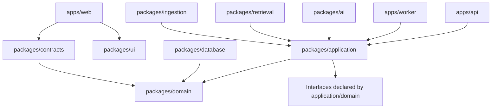

# Proposed project structure

## Repository shape

Use a pnpm/Turborepo monorepo with deployable applications separated from reusable domain packages.

```text
yomirai/
├── apps/
│   ├── web/                    # Next.js product UI
│   ├── api/                    # Fastify HTTP + SSE API
│   └── worker/                 # Research, ingestion, indexing jobs
├── packages/
│   ├── contracts/              # API/event/operation schemas and generated types
│   ├── domain/                 # Pure domain model, invariants, operation semantics
│   ├── application/            # Use cases/ports; no web or provider code
│   ├── database/               # SQL schema, migrations, repositories, outbox
│   ├── ai/                     # Orchestration, prompts, model/tool provider ports
│   ├── retrieval/              # Hybrid search, context builder, ranking
│   ├── ingestion/              # File parsing, chunking, sanitization, metadata
│   ├── ui/                     # Shared design system and accessible primitives
│   ├── observability/          # Logging, tracing, metrics, redaction
│   ├── auth/                   # Auth adapter and authorization helpers
│   ├── config/                 # Typed runtime configuration
│   └── testkit/                # Fixtures, builders, fake providers, eval helpers
├── prompts/
│   ├── router/
│   ├── planner/
│   ├── extractor/
│   ├── synthesizer/
│   └── verifier/
├── evals/
│   ├── datasets/               # Versioned task fixtures, no private production data
│   ├── graders/                # Deterministic and model-assisted graders
│   ├── suites/                 # Router, retrieval, extraction, synthesis, E2E
│   └── reports/                # Generated locally/CI; usually gitignored
├── docs/
│   ├── adr/                    # Architecture decision records
│   ├── design/                 # Visual direction, design system, motion, and screen specs
│   ├── implementation/         # Executable MVP stages, dependencies, and release gates
│   └── *.md                    # Product and system documentation
├── tooling/
│   ├── eslint/
│   ├── typescript/
│   └── scripts/
├── infra/
│   ├── local/                  # Local DB/storage development setup
│   ├── migrations/             # Deployment orchestration if not in database package
│   └── deploy/                 # Hosting definitions after vendor selection
├── .github/workflows/          # CI once GitHub is used
├── package.json
├── pnpm-workspace.yaml
└── turbo.json
```

Do not create empty package folders until their first vertical slice needs them. This tree is the target ownership model, not a request to scaffold boilerplate immediately.

## Dependency direction



Rules:

- `domain` imports no framework, database, OpenAI SDK, or web code.
- `application` depends on domain types and declares ports for persistence, AI, tools, clock, IDs, and events.
- infrastructure packages implement ports; application code does not import their concrete vendors.
- apps are composition roots that wire packages and own process lifecycle.
- `web` consumes public contracts, not database/domain internals.
- prompts are versioned assets loaded through the AI package and identified in traces.

## Domain package modules

```text
packages/domain/src/
├── workspace/
│   ├── workspace.ts
│   ├── membership.ts
│   └── policy.ts
├── knowledge/
│   ├── object.ts
│   ├── relation.ts
│   ├── epistemic-status.ts
│   └── predicates.ts
├── evidence/
│   ├── source.ts
│   ├── evidence-span.ts
│   └── evidence-link.ts
├── views/
│   ├── view.ts
│   └── view-query.ts
├── changes/
│   ├── changeset.ts
│   ├── operations.ts
│   ├── validation.ts
│   └── commit.ts
├── research/
│   ├── request.ts
│   ├── job.ts
│   └── budget.ts
└── shared/
    ├── ids.ts
    ├── result.ts
    └── errors.ts
```

The change operation definitions should be exhaustive discriminated unions. That makes it hard for a new operation to appear without handling validation, apply, diff rendering, authorization, audit, and revert behavior.

## Application package modules

Use cases are organized by capability, not transport endpoint:

```text
packages/application/src/
├── workspaces/
│   ├── create-workspace.ts
│   └── get-workspace.ts
├── knowledge/
│   ├── search-objects.ts
│   └── get-object-detail.ts
├── changes/
│   ├── validate-changeset.ts
│   ├── apply-changeset.ts
│   └── revert-commit.ts
├── research/
│   ├── submit-request.ts
│   ├── run-research-stage.ts
│   └── cancel-job.ts
├── documents/
│   ├── complete-upload.ts
│   └── ingest-document.ts
└── ports/
    ├── repositories.ts
    ├── unit-of-work.ts
    ├── model-provider.ts
    ├── search-tools.ts
    ├── object-storage.ts
    └── event-publisher.ts
```

## AI package structure

```text
packages/ai/src/
├── orchestrator/
│   ├── request-router.ts
│   ├── workflow.ts
│   ├── stage-runner.ts
│   ├── stop-evaluator.ts
│   └── budgets.ts
├── context/
│   ├── context-planner.ts
│   └── context-serializer.ts
├── operations/
│   ├── proposal-decoder.ts
│   └── semantic-validator.ts
├── tools/
│   ├── registry.ts
│   ├── workspace-search.ts
│   ├── document-search.ts
│   └── web-search.ts
├── providers/
│   └── openai/
│       ├── responses-adapter.ts
│       ├── structured-output.ts
│       └── citation-normalizer.ts
└── prompts/
    ├── loader.ts
    └── versions.ts
```

Provider adapters translate OpenAI items, tool calls, citations, usage, refusals, and errors into internal execution types. No OpenAI response object crosses into the domain or public API.

## Web feature structure

Prefer feature folders with co-located UI state and tests:

```text
apps/web/src/
├── app/                        # Routes/layout/composition
├── features/
│   ├── workspace-explorer/
│   ├── command-bar/
│   ├── activity-drawer/
│   ├── proposal-review/
│   ├── object-inspector/
│   ├── document-view/
│   ├── table-view/
│   ├── graph-view/
│   ├── timeline-view/
│   └── commit-history/
├── entities/                   # Client read models and query hooks
├── lib/                        # API client, SSE, routing, local utilities
└── styles/
```

Complex view packages should share selection, object links, evidence badges, and inspector behavior. Each view must not invent its own mutation protocol.

## Testing layout

- Pure domain tests live next to domain modules.
- Application use cases use in-memory/fake ports from `testkit`.
- Database integration tests run against real PostgreSQL.
- API contract tests verify schemas, authorization, idempotency, and concurrency.
- Web component tests cover proposal decisions and accessible navigation.
- End-to-end tests exercise the vertical slices in the roadmap.
- AI evals are separate from deterministic CI tests but a stable smoke subset runs on relevant changes.

Suggested naming:

```text
*.test.ts              # deterministic unit/component test
*.integration.test.ts  # real infrastructure boundary
*.contract.test.ts     # API/event/provider adapter contract
*.eval.ts              # model/retrieval evaluation case or suite
```

## Configuration and secrets

- Validate environment configuration at process startup.
- Separate public web configuration from server secrets.
- Use one model-role mapping configuration shared by API and worker.
- Never expose provider keys to the browser.
- Store prompt/model/tool version configuration with each execution.
- Local development uses example/placeholder secrets, not committed credentials.

## CI stages

1. format/lint/type check;
2. unit and contract tests;
3. database migration and integration tests;
4. web build and accessibility smoke tests;
5. API/worker build;
6. security/dependency checks;
7. stable offline/mock evals;
8. opt-in live model evals for prompt/provider changes;
9. artifact/image build and migration compatibility check.

## Documentation ownership

- Update the domain model when operation/object semantics change.
- Add or supersede an ADR for durable architectural changes.
- Update API/event docs with contract schema changes.
- Update eval datasets and release gates with prompt/model behavior changes.
- Keep the roadmap as product planning, not a historical changelog.
