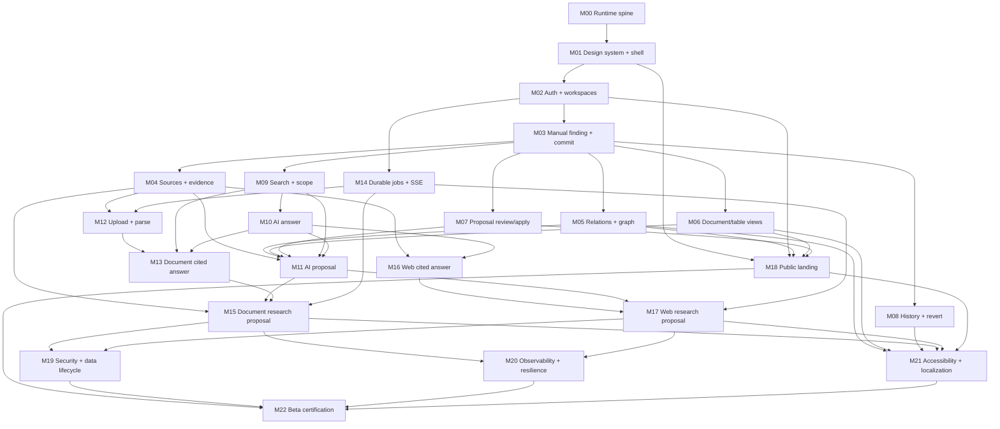

# Dependencies and parallelism

## Dependency semantics

The task IDs in this document are the vertical stages from [MVP vertical stages](01-mvp-vertical-stages.md).

- A dependency means the predecessor’s acceptance criteria and tests are complete and merged.
- A stage may use only stable public contracts from completed predecessors.
- A stage must not read an unmerged branch or assume a future schema/UI exists.
- Parallel-safe means outcomes are independent after prerequisites are merged; it does not mean agents may edit the same files without coordination.

## Exact prerequisite table

| Task | Direct prerequisites | Why |
| --- | --- | --- |
| `M00` | None | Establishes executable repository and runtime |
| `M01` | `M00` | Requires web/tooling/test foundation |
| `M02` | `M01` | Uses shell, controls, responsive/accessibility baseline |
| `M03` | `M02` | Requires authenticated workspace boundary and persistence |
| `M04` | `M03` | Evidence attaches to committed canonical findings |
| `M05` | `M03` | Relations connect committed canonical objects |
| `M06` | `M03` | Views query committed canonical objects |
| `M07` | `M03` | Proposal apply reuses stable object operation/commit path |
| `M08` | `M03` | History/revert requires real commits and operations |
| `M09` | `M03` | Search/scope requires canonical authorized objects |
| `M10` | `M09` | AI answer requires bounded authorized context/scope |
| `M11` | `M04`, `M05`, `M06`, `M07`, `M09`, `M10` | Needs all MVP operation variants, provider path, context, and review/apply path |
| `M12` | `M04`, `M14` | Uploaded documents become sources/evidence records and reuse durable job infrastructure |
| `M13` | `M09`, `M10`, `M12` | Needs document content, search/context, and answer/provider path |
| `M14` | `M02` | Durable job framework needs workspace/auth and shell, not AI research |
| `M15` | `M04`, `M11`, `M13`, `M14` | Needs evidence model, proposals, document retrieval, and jobs |
| `M16` | `M04`, `M10` | Needs source/evidence normalization and non-persistent answer path |
| `M17` | `M11`, `M14`, `M16` | Needs proposals, durable loop, and normalized web citations |
| `M18` | `M01`, `M02`, `M05`, `M06`, `M07` | Marketing proof uses real brand shell, auth entry, graph/views, and proposal UX |
| `M19` | `M15`, `M17` | Security/data lifecycle closes after document and web research paths exist |
| `M20` | `M15`, `M17` | Observability/resilience validates complete long-running workflows |
| `M21` | `M05`, `M06`, `M08`, `M15`, `M17`, `M18` | Accessibility/localization covers every required product/public journey |
| `M22` | `M18`, `M19`, `M20`, `M21` | Deployment certification consumes public and hardening evidence |

Transitive prerequisites are intentionally omitted from the table. For example, `M15` indirectly includes `M00–M03`, `M07`, `M09`, and `M10` through its direct prerequisites.

## Dependency graph



## Critical path

The longest capability path is expected to be:

```text
M00 → M01 → M02 → M03 → M04/M05/M06/M07/M09 → M10 → M11
                     └→ M04 → M12 → M13 ──────────┐
M02 → M14 ────────────────────────────────────────┼→ M15 ─┬→ M19/M20 ─┐
                                         └→ M16 → M17 ───────┼→ M22
M05/M06/M08/M18 ────────────────────────────────→ M21 ───────┘
```

`M04`, `M09`, and `M14` should start as soon as their prerequisites allow because they feed multiple downstream tasks.

`M05`, `M06`, `M08`, and `M18` are not on the AI research critical path, but they are mandatory before `M21`/`M22` because the MVP definition includes graph/document/table exploration, revert, and a public beta entry.

## Safe parallel execution sets

The following sets can be assigned to separate agents after all listed prerequisites are merged.

### Parallel set A — after M02

| Task | Independent result | Shared-risk note |
| --- | --- | --- |
| `M03` | Manual canonical knowledge/commit path | Owns knowledge/change foundation; must merge before dependent features |
| `M14` | Fixture-backed jobs/SSE | Uses research/job modules; coordinate only shared DB migration numbering and activity UI |

These are safe because M14 does not create or mutate knowledge objects.

### Parallel set B — after M03

| Task | Primary ownership |
| --- | --- |
| `M04` | Evidence/source domain and UI |
| `M05` | Relation/neighborhood domain and graph UI |
| `M06` | Saved-view domain and document/table UI |
| `M07` | Change-set proposal/review/application |
| `M08` | Commit history/inverse operations |
| `M09` | Search/context/scope |

These tasks are semantically independent but touch shared `contracts`, `database`, and sometimes `domain/changes`. They are safe in parallel only under the contract-freeze rules below.

Recommended lower-conflict pairings:

- `M04` + `M06` + `M14`;
- `M05` + `M08` + `M09`;
- `M07` with any one of the above if object operation contracts from M03 remain unchanged.

Avoid assigning all six simultaneously unless migration IDs, operation registry ownership, and API schema generation have explicit coordination.

### Parallel set C — after M04, M07, M09, M10, and M14 reach required states

| Lane | Tasks | Notes |
| --- | --- | --- |
| Document lane | `M12` → `M13` | Sequential inside lane; independent of web lane |
| Web lane | `M16` | Independent of document ingestion/retrieval |
| Proposal lane | `M11` after M05/M06 also complete | Can run while M12 proceeds; freezes all MVP operation variants |
| UI/public lane | `M18` once M05/M06/M07 complete | No worker/AI dependency |

`M12`, `M16`, and `M11` are safe to execute concurrently. `M13` must wait for `M12`, but can then continue while `M16` or `M18` is in progress.

### Parallel set D — full research lanes

After their own prerequisites:

- `M15` document research;
- `M17` web research;
- `M18` public landing if not already complete;
- remaining `M05`, `M06`, or `M08` work needed for beta.

`M15` and `M17` are safely parallel at the product level. They share AI orchestration and prompt packages, so use the provider/tool ownership rules below to minimize merge conflicts.

### Parallel set E — hardening lanes

After `M15` and `M17` are merged:

- `M19` security and data lifecycle;
- `M20` observability, resilience, and performance;
- `M21` accessibility/localization, once its additional view/public prerequisites are also merged.

These are separate single-agent tasks and may run concurrently. If a finding requires a shared product behavior change, route the change through the owning feature module and reference the same fix from the relevant hardening reports.

## Tasks that must remain serial

| Sequence | Reason |
| --- | --- |
| `M00 → M01 → M02 → M03` | Runtime, shell, workspace boundary, and canonical mutation foundation |
| `M09 → M10` | Model must consume tested authorized context |
| `M04–M07 + M09 + M10 → M11` | AI proposals require all operation variants, review/apply, scope, and provider path |
| `M04 + M14 → M12 → M13` | Source/job foundations precede parsing; parsed content precedes retrieval/citations |
| `M13 + M11 + M14 → M15` | Document research combines retrieval, proposal, and durable workflow |
| `M16 + M11 + M14 → M17` | Web research combines normalized web evidence, proposal, and workflow |
| `M15` + `M17` → `M19` and `M20` | Security/resilience evaluate complete research paths |
| all required product/public branches → `M21` | Accessibility cannot certify absent screens |
| `M18` + `M19` + `M20` + `M21` → `M22` | Deployment certification consumes completed hardening evidence |

## Contract-freeze rules for parallel agents

### Domain and operation contracts

After M03 merges:

- common object envelope, IDs, revision semantics, operation envelope, commit envelope, and error envelope are frozen;
- feature stages may add a new operation variant but cannot change existing variant meaning;
- every new operation variant must add validator, authorizer, applier, diff serializer, audit representation, and revert policy (`supported` or explicit `not supported`);
- breaking changes require a short ADR and rebase of dependent work before merge.

### Database migrations

- Each parallel task receives a reserved migration prefix/range or timestamp convention.
- Migrations are additive whenever possible.
- No parallel task edits a predecessor migration after it has merged.
- Each branch rebases and runs the full migration chain from an empty database before merge.
- Schema ownership follows the primary module in the parallel tables above.

### API contracts

- Shared error, pagination, ID, workspace version, and idempotency schemas are frozen after M03.
- Feature tasks add namespaced endpoints/resources and generated types.
- Contract snapshots are reviewed before merging two branches that both changed `packages/contracts`.
- The web app imports contracts; it does not copy response types.

### UI ownership

- M01 owns primitives/tokens/shell.
- Feature agents compose primitives and may extend them only with backwards-compatible states.
- Explorer/canvas/inspector/command-dock layout contracts are changed only by the shell owner or a dedicated integration change.
- Feature agents own their route and feature folder; shared selection is owned by M09, proposal review by M07, activity by M14.

### AI orchestration and prompts

- M10 owns provider port, answer/router baseline, prompt loader, and execution metadata.
- M11 owns structured proposal decoding.
- M15 owns document planner/extractor/synthesizer composition.
- M16 owns web-search/citation normalization.
- M17 owns bounded web loop/stop evaluator integration.
- Prompts live in separate task-specific folders and carry independent versions.
- Provider response types never leak into shared domain contracts.

## Recommended integration sequence

Even when implementation occurs in parallel, merge in dependency order:

1. foundation branch (`M00–M03`);
2. `M04`, `M07`, `M09`, `M14` early because they unblock the critical path;
3. `M05`, `M06`, `M08` as soon as their suites are green;
4. `M10`, then `M11`;
5. `M12`, then `M13`; in parallel, `M16`;
6. `M15` and `M17` independently;
7. `M18` when real product fixtures are available;
8. `M19`, `M20`, and `M21` in parallel after their prerequisites;
9. `M22` only after every hardening/public branch is merged and stable.

## Parallel handoff protocol

Before starting a parallel task, the agent records:

- prerequisite commit hashes;
- owned modules/files;
- new contracts/operation variants/migrations planned;
- external ports or fakes required;
- expected verification command.

Before merge, the agent provides:

- changed modules and public contracts;
- migration IDs and schema effects;
- tests/evals run and results;
- verification artifact;
- known limitations that do not violate acceptance criteria;
- rebase result against the latest prerequisite branch.

If two agents need a breaking change to the same frozen contract, those tasks are no longer safely parallel. Stop, resolve the contract in one small integration task, merge it, and rebase both branches.
